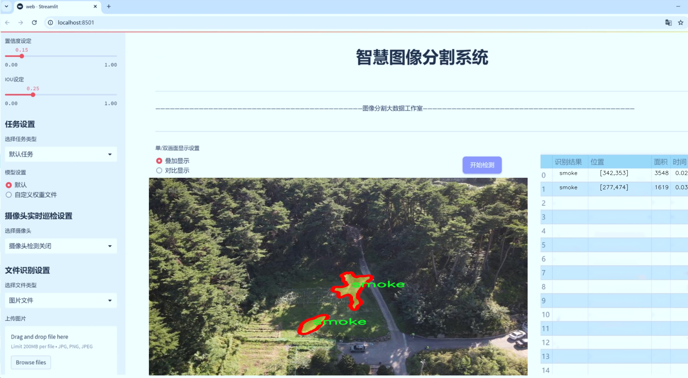
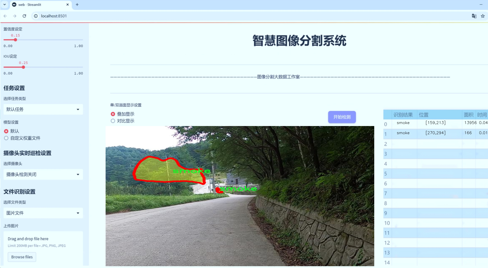
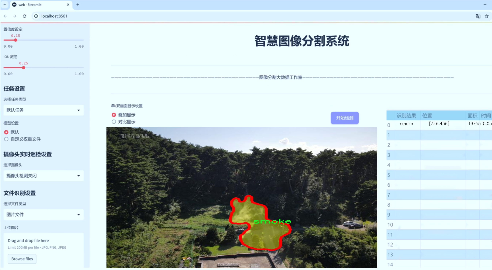
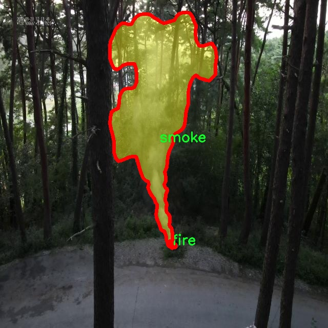
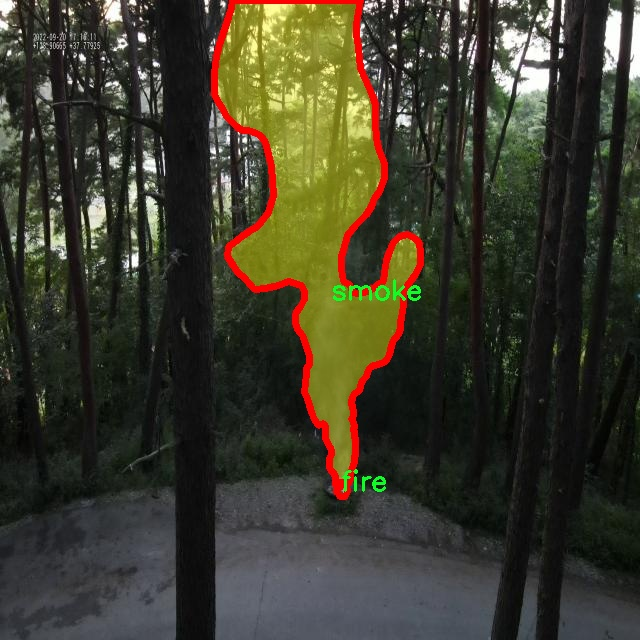
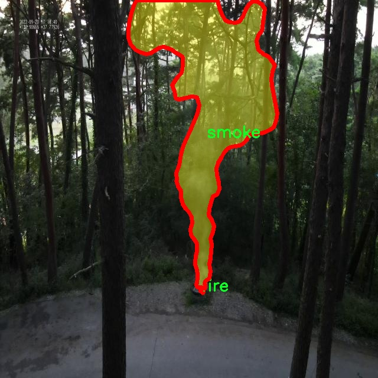
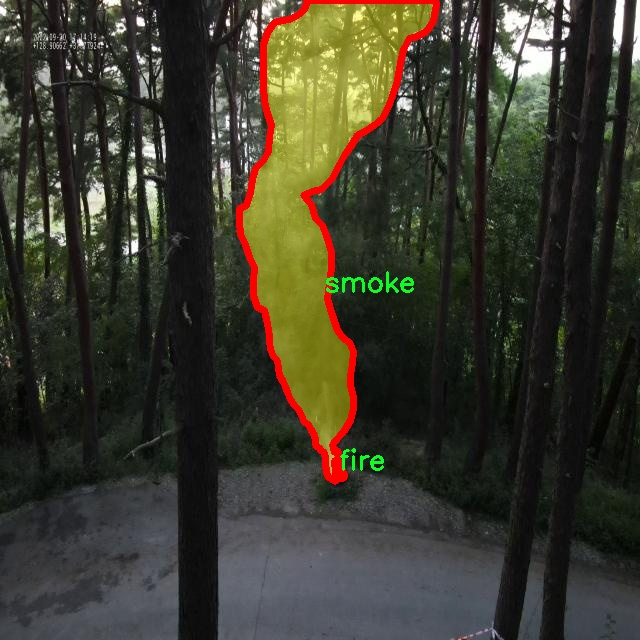
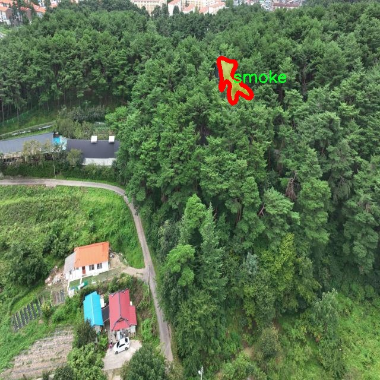

# 云火烟分割系统： yolov8-seg-RepHGNetV2

### 1.研究背景与意义

[参考博客](https://gitee.com/YOLOv8_YOLOv11_Segmentation_Studio/projects)

[博客来源](https://kdocs.cn/l/cszuIiCKVNis)

研究背景与意义

随着城市化进程的加快和气候变化的影响，自然灾害和人为火灾的频发已成为全球面临的重要挑战之一。火灾不仅对生态环境造成严重破坏，还对人类生命财产安全构成了极大的威胁。因此，及时、准确地检测和分割火灾烟雾及云层的图像信息，对于火灾的预警、救援和环境监测具有重要的现实意义。近年来，深度学习技术的迅猛发展为图像处理领域带来了新的机遇，尤其是在目标检测和分割任务中，基于卷积神经网络（CNN）的算法表现出了优异的性能。

YOLO（You Only Look Once）系列模型作为一种高效的目标检测算法，因其快速的推理速度和较高的准确率而广泛应用于实时监控和图像分析中。YOLOv8作为该系列的最新版本，进一步提升了模型的检测精度和速度，适合于复杂场景下的目标识别与分割。然而，现有的YOLOv8模型在处理云火烟等复杂背景下的图像时，仍然面临着分割精度不足、对小目标识别能力弱等问题。因此，基于改进YOLOv8的云火烟分割系统的研究，旨在通过优化模型结构和训练策略，提高对火灾相关图像的分割性能。

本研究所使用的数据集包含8700幅图像，涵盖了云、火和烟三类目标。这一数据集的构建为模型的训练和验证提供了丰富的样本，确保了模型在不同场景下的泛化能力。数据集中每一类目标的标注信息将为模型的学习提供明确的指导，进而提升其在实际应用中的表现。通过对这些图像的深入分析，可以提取出云、火和烟的特征信息，进而实现更为精准的分割和识别。

本研究的意义不仅在于提升火灾监测的技术水平，更在于为相关领域提供一种新的解决方案。通过改进YOLOv8模型，能够实现对火灾及其相关现象的实时监测与分析，为消防部门和环境保护机构提供科学依据，帮助其制定有效的应对措施。此外，研究成果还可为无人机巡检、智能监控等应用场景提供技术支持，推动智能城市和智慧消防的发展。

综上所述，基于改进YOLOv8的云火烟分割系统的研究，具有重要的理论价值和实践意义。通过提升火灾监测的准确性和实时性，能够有效降低火灾带来的损失，促进社会的可持续发展。同时，该研究也为深度学习在图像分割领域的应用提供了新的思路和方法，推动了相关技术的进步与创新。

### 2.图片演示







注意：本项目提供完整的训练源码数据集和训练教程,由于此博客编辑较早,暂不提供权重文件（best.pt）,需要按照6.训练教程进行训练后实现上图效果。

### 3.视频演示

[3.1 视频演示](https://www.bilibili.com/video/BV1BCUmYfE9K/)

### 4.数据集信息

##### 4.1 数据集类别数＆类别名

nc: 3
names: ['cloud', 'fire', 'smoke']


##### 4.2 数据集信息简介

数据集信息展示

在本研究中，我们采用了名为“ai_hub3”的数据集，以支持对云火烟分割系统的训练，特别是针对改进版YOLOv8-seg模型的应用。该数据集专注于环境监测与灾害预警领域，尤其是在火灾发生时对云、火焰和烟雾的实时检测与分割。数据集的设计考虑到了多种场景和条件，确保了模型在实际应用中的有效性和鲁棒性。

“ai_hub3”数据集包含三个主要类别，分别是“cloud”（云）、“fire”（火）和“smoke”（烟）。这三个类别的选择反映了在火灾监测中最为关键的视觉元素。云的存在可能会影响火灾的可见性，而火焰和烟雾则是火灾的直接指示。通过对这三类目标的精确分割，模型能够更好地理解和分析火灾场景，从而为后续的决策提供支持。

数据集的构建过程经过了严格的筛选和标注，确保每个类别的样本具有代表性和多样性。样本来源于不同的环境条件，包括城市、森林和农村地区，涵盖了不同的天气情况和光照条件。这种多样性使得模型在训练过程中能够学习到丰富的特征，增强其在实际应用中的适应能力。此外，数据集中的图像分辨率和质量经过精心处理，以保证模型能够提取到足够的细节信息，从而提高分割的精度。

在数据集的标注过程中，采用了专业的标注工具和经验丰富的标注团队，确保每个图像中的目标被准确地框定和标记。标注的精确性直接影响到模型的训练效果，因此在标注完成后，团队还进行了多轮的审核和修正，以消除潜在的错误和不一致性。这一过程不仅提高了数据集的质量，也为后续的模型训练奠定了坚实的基础。

在训练过程中，YOLOv8-seg模型将利用“ai_hub3”数据集中的图像和相应的标注信息进行学习。模型通过不断调整参数，优化其在不同类别上的分割能力，力求在云、火和烟的分割任务中达到最佳性能。为了评估模型的效果，我们将使用标准的评价指标，如交并比（IoU）、精确率和召回率等，对模型的分割结果进行全面分析。这些指标将帮助我们了解模型在各个类别上的表现，进而为后续的改进提供依据。

综上所述，“ai_hub3”数据集不仅为云火烟分割系统的训练提供了丰富的样本和高质量的标注，还为研究人员在火灾监测和环境保护领域的应用提供了重要的数据支持。通过对该数据集的深入分析和应用，我们期望能够提升YOLOv8-seg模型在实际场景中的表现，为火灾预警和应急响应提供更为精准的技术支持。











### 5.项目依赖环境部署教程（零基础手把手教学）

[5.1 环境部署教程链接（零基础手把手教学）](https://www.bilibili.com/video/BV1jG4Ve4E9t/?vd_source=bc9aec86d164b67a7004b996143742dc)


[5.2 安装Python虚拟环境创建和依赖库安装视频教程链接（零基础手把手教学）](https://www.bilibili.com/video/BV1nA4VeYEze/?vd_source=bc9aec86d164b67a7004b996143742dc)

### 6.手把手YOLOV8-seg训练视频教程（零基础手把手教学）

[6.1 手把手YOLOV8-seg训练视频教程（零基础小白有手就能学会）](https://www.bilibili.com/video/BV1cA4VeYETe/?vd_source=bc9aec86d164b67a7004b996143742dc)


按照上面的训练视频教程链接加载项目提供的数据集，运行train.py即可开始训练



     Epoch   gpu_mem       box       obj       cls    labels  img_size
     1/200     0G   0.01576   0.01955  0.007536        22      1280: 100%|██████████| 849/849 [14:42<00:00,  1.04s/it]
               Class     Images     Labels          P          R     mAP@.5 mAP@.5:.95: 100%|██████████| 213/213 [01:14<00:00,  2.87it/s]
                 all       3395      17314      0.994      0.957      0.0957      0.0843

     Epoch   gpu_mem       box       obj       cls    labels  img_size
     2/200     0G   0.01578   0.01923  0.007006        22      1280: 100%|██████████| 849/849 [14:44<00:00,  1.04s/it]
               Class     Images     Labels          P          R     mAP@.5 mAP@.5:.95: 100%|██████████| 213/213 [01:12<00:00,  2.95it/s]
                 all       3395      17314      0.996      0.956      0.0957      0.0845

     Epoch   gpu_mem       box       obj       cls    labels  img_size
     3/200     0G   0.01561    0.0191  0.006895        27      1280: 100%|██████████| 849/849 [10:56<00:00,  1.29it/s]
               Class     Images     Labels          P          R     mAP@.5 mAP@.5:.95: 100%|███████   | 187/213 [00:52<00:00,  4.04it/s]
                 all       3395      17314      0.996      0.957      0.0957      0.0845


### 7.50+种全套YOLOV8-seg创新点加载调参实验视频教程（一键加载写好的改进模型的配置文件）

[7.1 50+种全套YOLOV8-seg创新点加载调参实验视频教程（一键加载写好的改进模型的配置文件）](https://www.bilibili.com/video/BV1Hw4VePEXv/?vd_source=bc9aec86d164b67a7004b996143742dc)

### YOLOV8-seg算法简介

原始YOLOv8-seg算法原理

YOLOv8-seg算法是Ultralytics公司在2023年推出的YOLO系列中的一个重要版本，它在前几代YOLO算法的基础上进行了多项创新和改进，尤其是在目标检测和图像分割任务中表现出色。YOLOv8的设计理念围绕着快速、准确和易于使用展开，使其成为多种计算机视觉任务的理想选择。其核心在于通过优化网络结构和算法，提升了模型的性能和灵活性。

YOLOv8的网络结构分为三个主要部分：输入层、主干网络（Backbone）和检测头（Head）。在输入层，YOLOv8默认接受640x640像素的图像作为输入。然而，考虑到实际应用中图像长宽比的多样性，YOLOv8采用了一种自适应图像缩放的方法。这种方法通过将图像的长边按比例缩小到指定尺寸，然后对短边进行填充，从而减少信息冗余，提高了目标检测和推理的速度。此外，在训练过程中，YOLOv8使用了Mosaic图像增强技术，通过随机拼接四张图像，迫使模型学习不同位置和周围像素的特征，从而提高了模型的泛化能力和预测精度。

在主干网络部分，YOLOv8的设计借鉴了YOLOv7中的ELAN模块，将YOLOv5中的C3模块替换为C2F模块。C2F模块通过引入更多的分支，丰富了梯度流的信息，使得模型在保持轻量化的同时，能够获得更高的精度和更合理的延迟。这种设计不仅提高了特征提取的能力，还使得模型在处理复杂场景时表现得更加稳定。

YOLOv8的Neck部分同样进行了重要的改进。与YOLOv5相比，YOLOv8去除了两次上采样之前的1x1卷积连接层，直接对主干网络不同阶段输出的特征进行上采样。这种简化的结构不仅提高了计算效率，还减少了信息损失，使得特征融合更加高效。通过FPN（特征金字塔网络）和PAN（路径聚合网络）的结合，YOLOv8能够在多尺度信息之间进行充分的融合，从而增强了模型对不同尺寸目标的检测能力。

在检测头部分，YOLOv8采用了解耦头（Decoupled Head）结构，分别处理分类和定位任务。与之前的耦合头结构不同，解耦头通过两个并行的分支，分别提取类别特征和位置特征。这种设计使得模型在处理复杂场景时，能够更好地聚焦于目标的特征，提高了检测的准确性。此外，YOLOv8摒弃了传统的Anchor-Based方法，转而采用Anchor-Free的方法，将目标检测转化为关键点检测。这一创新不仅简化了模型的结构，还提高了模型的泛化能力，使其在不同数据集上都能保持良好的性能。

在损失函数的设计上，YOLOv8也进行了重要的改进。YOLOv8采用了VFL Loss（Varifocal Loss）作为分类损失，CIoULoss和DFLLoss作为回归损失。VFL Loss通过不对称参数对正负样本进行加权，提升了高质量样本对损失的贡献，从而使得模型在训练过程中能够更好地聚焦于重要的正样本。这种动态的标签分配策略，结合了YOLOv6的TOOD策略，使得YOLOv8在处理正负样本匹配时更加灵活和高效。

综上所述，YOLOv8-seg算法通过对网络结构的多项创新和优化，提升了目标检测和图像分割的性能。其自适应图像缩放、C2F模块的引入、解耦头结构的设计以及动态标签分配策略的应用，使得YOLOv8在多种计算机视觉任务中展现出卓越的能力。随着YOLOv8的不断发展和应用，预计其将在更多领域中发挥重要作用，推动计算机视觉技术的进一步进步。


### 9.系统功能展示（检测对象为举例，实际内容以本项目数据集为准）

图9.1.系统支持检测结果表格显示

  图9.2.系统支持置信度和IOU阈值手动调节

  图9.3.系统支持自定义加载权重文件best.pt(需要你通过步骤5中训练获得)

  图9.4.系统支持摄像头实时识别

  图9.5.系统支持图片识别

  图9.6.系统支持视频识别

  图9.7.系统支持识别结果文件自动保存

  图9.8.系统支持Excel导出检测结果数据


### 10.50+种全套YOLOV8-seg创新点原理讲解（非科班也可以轻松写刊发刊，V11版本正在科研待更新）

#### 10.1 由于篇幅限制，每个创新点的具体原理讲解就不一一展开，具体见下列网址中的创新点对应子项目的技术原理博客网址【Blog】：


[10.1 50+种全套YOLOV8-seg创新点原理讲解链接](https://gitee.com/qunmasj/good)

#### 10.2 部分改进模块原理讲解(完整的改进原理见上图和技术博客链接)【如果此小节的图加载失败可以通过CSDN或者Github搜索该博客的标题访问原始博客，原始博客图片显示正常】

### YOLOv8简介

按照官方描述，YOLOv8 是一个 SOTA 模型，它建立在以前 YOLO 版本的成功基础上，并引入了新的功能和改进，以进一步提升性能和灵活性。具体创新包括一个新的骨干网络、一个新的 Ancher-Free 检测头和一个新的损失函数，可以在从 CPU 到 GPU 的各种硬件平台上运行。

不过 ultralytics 并没有直接将开源库命名为 YOLOv8，而是直接使用 ultralytics 这个词，原因是 ultralytics 将这个库定位为算法框架，而非某一个特定算法，一个主要特点是可扩展性。其希望这个库不仅仅能够用于 YOLO 系列模型，而是能够支持非 YOLO 模型以及分类分割姿态估计等各类任务。
总而言之，ultralytics 开源库的两个主要优点是：

融合众多当前 SOTA 技术于一体
未来将支持其他 YOLO 系列以及 YOLO 之外的更多算法


下表为官方在 COCO Val 2017 数据集上测试的 mAP、参数量和 FLOPs 结果。可以看出 YOLOv8 相比 YOLOv5 精度提升非常多，但是 N/S/M 模型相应的参数量和 FLOPs 都增加了不少，从上图也可以看出相比 YOLOV5 大部分模型推理速度变慢了。


额外提一句，现在各个 YOLO 系列改进算法都在 COCO 上面有明显性能提升，但是在自定义数据集上面的泛化性还没有得到广泛验证，至今依然听到不少关于 YOLOv5 泛化性能较优异的说法。对各系列 YOLO 泛化性验证也是 MMYOLO 中一个特别关心和重点发力的方向。

### YOLO-MS简介
实时目标检测，以YOLO系列为例，已在工业领域中找到重要应用，特别是在边缘设备（如无人机和机器人）中。与之前的目标检测器不同，实时目标检测器旨在在速度和准确性之间追求最佳平衡。为了实现这一目标，提出了大量的工作：从第一代DarkNet到CSPNet，再到最近的扩展ELAN，随着性能的快速增长，实时目标检测器的架构经历了巨大的变化。

尽管性能令人印象深刻，但在不同尺度上识别对象仍然是实时目标检测器面临的基本挑战。这促使作者设计了一个强大的编码器架构，用于学习具有表现力的多尺度特征表示。具体而言，作者从两个新的角度考虑为实时目标检测编码多尺度特征：

从局部视角出发，作者设计了一个具有简单而有效的分层特征融合策略的MS-Block。受到Res2Net的启发，作者在MS-Block中引入了多个分支来进行特征提取，但不同的是，作者使用了一个带有深度卷积的 Inverted Bottleneck Block块，以实现对大Kernel的高效利用。

从全局视角出发，作者提出随着网络加深逐渐增加卷积的Kernel-Size。作者在浅层使用小Kernel卷积来更高效地处理高分辨率特征。另一方面，在深层中，作者采用大Kernel卷积来捕捉广泛的信息。

基于以上设计原则，作者呈现了作者的实时目标检测器，称为YOLO-MS。为了评估作者的YOLO-MS的性能，作者在MS COCO数据集上进行了全面的实验。还提供了与其他最先进方法的定量比较，以展示作者方法的强大性能。如图1所示，YOLO-MS在计算性能平衡方面优于其他近期的实时目标检测器。


具体而言，YOLO-MS-XS在MS COCO上获得了43%+的AP得分，仅具有450万个可学习参数和8.7亿个FLOPs。YOLO-MS-S和YOLO-MS分别获得了46%+和51%+的AP，可学习参数分别为810万和2220万。此外，作者的工作还可以作为其他YOLO模型的即插即用模块。通常情况下，作者的方法可以将YOLOv8的AP从37%+显著提高到40%+，甚至还可以使用更少的参数和FLOPs。


#### Multi-Scale Building Block Design
CSP Block是一个基于阶段级梯度路径的网络，平衡了梯度组合和计算成本。它是广泛应用于YOLO系列的基本构建块。已经提出了几种变体，包括YOLOv4和YOLOv5中的原始版本，Scaled YOLOv4中的CSPVoVNet，YOLOv7中的ELAN，以及RTMDet中提出的大Kernel单元。作者在图2(a)和图2(b)中分别展示了原始CSP块和ELAN的结构。


上述实时检测器中被忽视的一个关键方面是如何在基本构建块中编码多尺度特征。其中一个强大的设计原则是Res2Net，它聚合了来自不同层次的特征以增强多尺度表示。然而，这一原则并没有充分探索大Kernel卷积的作用，而大Kernel卷积已经在基于CNN的视觉识别任务模型中证明有效。将大Kernel卷积纳入Res2Net的主要障碍在于它们引入的计算开销，因为构建块采用了标准卷积。在作者的方法中，作者提出用 Inverted Bottleneck Block替代标准的3 × 3卷积，以享受大Kernel卷积的好处。

基于前面的分析，作者提出了一个带有分层特征融合策略的全新Block，称为MS-Block，以增强实时目标检测器在提取多尺度特征时的能力，同时保持快速的推理速度。

MS-Block的具体结构如图2(c)所示。假设是输入特征。通过1×1卷积的转换后，X的通道维度增加到n*C。然后，作者将X分割成n个不同的组，表示为，其中。为了降低计算成本，作者选择n为3。

注意，除了之外，每个其他组都经过一个 Inverted Bottleneck Block层，用表示，其中k表示Kernel-Size，以获得。的数学表示如下：


根据这个公式，该博客的作者不将 Inverted Bottleneck Block层连接，使其作为跨阶段连接，并保留来自前面层的信息。最后，作者将所有分割连接在一起，并应用1×1卷积来在所有分割之间进行交互，每个分割都编码不同尺度的特征。当网络加深时，这个1×1卷积也用于调整通道数。

#### Heterogeneous Kernel Selection Protocol
除了构建块的设计外，作者还从宏观角度探讨了卷积的使用。之前的实时目标检测器在不同的编码器阶段采用了同质卷积（即具有相同Kernel-Size的卷积），但作者认为这不是提取多尺度语义信息的最佳选项。

在金字塔结构中，从检测器的浅阶段提取的高分辨率特征通常用于捕捉细粒度语义，将用于检测小目标。相反，来自网络较深阶段的低分辨率特征用于捕捉高级语义，将用于检测大目标。如果作者在所有阶段都采用统一的小Kernel卷积，深阶段的有效感受野（ERF）将受到限制，影响大目标的性能。在每个阶段中引入大Kernel卷积可以帮助解决这个问题。然而，具有大的ERF的大Kernel可以编码更广泛的区域，这增加了在小目标外部包含噪声信息的概率，并且降低了推理速度。

在这项工作中，作者建议在不同阶段中采用异构卷积，以帮助捕获更丰富的多尺度特征。具体来说，在编码器的第一个阶段中，作者采用最小Kernel卷积，而最大Kernel卷积位于最后一个阶段。随后，作者逐步增加中间阶段的Kernel-Size，使其与特征分辨率的增加保持一致。这种策略允许提取细粒度和粗粒度的语义信息，增强了编码器的多尺度特征表示能力。

正如图所示，作者将k的值分别分配给编码器中的浅阶段到深阶段，取值为3、5、7和9。作者将其称为异构Kernel选择（HKS）协议。


作者的HKS协议能够在深层中扩大感受野，而不会对浅层产生任何其他影响。此外，HKS不仅有助于编码更丰富的多尺度特征，还确保了高效的推理。

如表1所示，将大Kernel卷积应用于高分辨率特征会产生较高的计算开销。然而，作者的HKS协议在低分辨率特征上采用大Kernel卷积，从而与仅使用大Kernel卷积相比，大大降低了计算成本。


在实践中，作者经验性地发现，采用HKS协议的YOLO-MS的推理速度几乎与仅使用深度可分离的3 × 3卷积相同。

#### Architecture
如图所示，作者模型的Backbone由4个阶段组成，每个阶段后面跟随1个步长为2的3 × 3卷积进行下采样。在第3个阶段后，作者添加了1个SPP块，与RTMDet中一样。在作者的编码器上，作者使用PAFPN作为Neck来构建特征金字塔[31, 35]。它融合了从Backbone不同阶段提取的多尺度特征。Neck中使用的基本构建块也是作者的MS-Block，在其中使用3 × 3深度可分离卷积进行快速推理。

此外，为了在速度和准确性之间取得更好的平衡，作者将Backbone中多级特征的通道深度减半。作者提供了3个不同尺度的YOLO-MS变体，即YOLO-MS-XS、YOLO-MS-S和YOLO-MS。不同尺度的YOLO-MS的详细配置列在表2中。对于YOLO-MS的其他部分，作者将其保持与RTMDet相同。


### 11.项目核心源码讲解（再也不用担心看不懂代码逻辑）

#### 11.1 ultralytics\models\sam\build.py

以下是对代码的核心部分进行分析和详细注释的结果：

```python
# 导入必要的库
from functools import partial
import torch
from ultralytics.utils.downloads import attempt_download_asset

# 导入模型所需的模块
from .modules.decoders import MaskDecoder
from .modules.encoders import ImageEncoderViT, PromptEncoder
from .modules.sam import Sam
from .modules.tiny_encoder import TinyViT
from .modules.transformer import TwoWayTransformer

def build_sam_vit_h(checkpoint=None):
    """构建并返回一个高尺寸的Segment Anything Model (SAM)模型。"""
    return _build_sam(
        encoder_embed_dim=1280,  # 编码器嵌入维度
        encoder_depth=32,         # 编码器深度
        encoder_num_heads=16,     # 编码器头数
        encoder_global_attn_indexes=[7, 15, 23, 31],  # 全局注意力索引
        checkpoint=checkpoint,     # 可选的检查点路径
    )

def _build_sam(encoder_embed_dim,
               encoder_depth,
               encoder_num_heads,
               encoder_global_attn_indexes,
               checkpoint=None,
               mobile_sam=False):
    """构建所选的SAM模型架构。"""
    prompt_embed_dim = 256  # 提示嵌入维度
    image_size = 1024       # 输入图像大小
    vit_patch_size = 16     # ViT的补丁大小
    image_embedding_size = image_size // vit_patch_size  # 图像嵌入大小

    # 根据是否为移动SAM选择不同的图像编码器
    image_encoder = (TinyViT(
        img_size=1024,
        in_chans=3,
        num_classes=1000,
        embed_dims=encoder_embed_dim,
        depths=encoder_depth,
        num_heads=encoder_num_heads,
        window_sizes=[7, 7, 14, 7],
        mlp_ratio=4.0,
        drop_rate=0.0,
        drop_path_rate=0.0,
        use_checkpoint=False,
        mbconv_expand_ratio=4.0,
        local_conv_size=3,
    ) if mobile_sam else ImageEncoderViT(
        depth=encoder_depth,
        embed_dim=encoder_embed_dim,
        img_size=image_size,
        mlp_ratio=4,
        norm_layer=partial(torch.nn.LayerNorm, eps=1e-6),
        num_heads=encoder_num_heads,
        patch_size=vit_patch_size,
        qkv_bias=True,
        use_rel_pos=True,
        global_attn_indexes=encoder_global_attn_indexes,
        window_size=14,
        out_chans=prompt_embed_dim,
    ))

    # 创建SAM模型
    sam = Sam(
        image_encoder=image_encoder,  # 图像编码器
        prompt_encoder=PromptEncoder(
            embed_dim=prompt_embed_dim,
            image_embedding_size=(image_embedding_size, image_embedding_size),
            input_image_size=(image_size, image_size),
            mask_in_chans=16,
        ),
        mask_decoder=MaskDecoder(
            num_multimask_outputs=3,
            transformer=TwoWayTransformer(
                depth=2,
                embedding_dim=prompt_embed_dim,
                mlp_dim=2048,
                num_heads=8,
            ),
            transformer_dim=prompt_embed_dim,
            iou_head_depth=3,
            iou_head_hidden_dim=256,
        ),
        pixel_mean=[123.675, 116.28, 103.53],  # 像素均值
        pixel_std=[58.395, 57.12, 57.375],      # 像素标准差
    )

    # 如果提供了检查点，则加载模型权重
    if checkpoint is not None:
        checkpoint = attempt_download_asset(checkpoint)  # 尝试下载检查点
        with open(checkpoint, 'rb') as f:
            state_dict = torch.load(f)  # 加载权重
        sam.load_state_dict(state_dict)  # 加载到模型中

    sam.eval()  # 设置模型为评估模式
    return sam  # 返回构建的模型

# 定义不同大小的SAM模型构建函数映射
sam_model_map = {
    'sam_h.pt': build_sam_vit_h,
    'sam_l.pt': build_sam_vit_l,
    'sam_b.pt': build_sam_vit_b,
    'mobile_sam.pt': build_mobile_sam,
}

def build_sam(ckpt='sam_b.pt'):
    """根据指定的检查点构建SAM模型。"""
    model_builder = None
    ckpt = str(ckpt)  # 将检查点转换为字符串，以支持Path类型
    for k in sam_model_map.keys():
        if ckpt.endswith(k):
            model_builder = sam_model_map.get(k)  # 获取对应的模型构建函数

    if not model_builder:
        raise FileNotFoundError(f'{ckpt} 不是一个支持的SAM模型。可用模型有: \n {sam_model_map.keys()}')

    return model_builder(ckpt)  # 调用模型构建函数并返回模型
```

### 代码核心部分分析：
1. **模型构建函数**：`build_sam_vit_h`, `build_sam_vit_l`, `build_sam_vit_b`, `build_mobile_sam` 函数用于构建不同尺寸的SAM模型，主要通过 `_build_sam` 函数来实现。
2. **`_build_sam` 函数**：这是构建SAM模型的核心函数，负责创建图像编码器、提示编码器和掩码解码器，并将它们组合成一个完整的SAM模型。
3. **模型权重加载**：如果提供了检查点路径，模型会尝试下载并加载预训练的权重。
4. **模型映射**：`sam_model_map` 字典将模型文件名映射到相应的构建函数，方便根据文件名构建对应的模型。
5. **错误处理**：在 `build_sam` 函数中，提供了对不支持的模型文件名的错误处理。

以上是对代码的核心部分的分析和详细注释，帮助理解模型的构建过程及其结构。

这个文件是一个用于构建“Segment Anything Model”（SAM）的Python脚本，主要涉及模型的不同版本的构建和初始化。文件中包含了多个函数，每个函数负责构建特定配置的SAM模型。

首先，文件引入了一些必要的库和模块，包括`torch`和一些自定义的模块，如`MaskDecoder`、`ImageEncoderViT`、`PromptEncoder`等。这些模块是实现SAM模型所需的不同组件。

接下来，文件定义了多个构建函数，例如`build_sam_vit_h`、`build_sam_vit_l`、`build_sam_vit_b`和`build_mobile_sam`。每个函数的作用是根据不同的参数配置构建对应大小的SAM模型。比如，`build_sam_vit_h`构建一个高配置的模型，使用了1280的嵌入维度、32的深度和16个头，而`build_mobile_sam`则构建一个适合移动设备的模型，使用了不同的嵌入维度和深度配置。

这些构建函数最终调用了一个私有函数`_build_sam`，该函数是实际构建模型的核心。它接收多个参数，包括编码器的嵌入维度、深度、头数以及是否为移动模型等。在这个函数中，首先定义了一些与模型相关的参数，比如提示嵌入维度、图像大小和补丁大小。然后根据是否为移动模型选择不同的图像编码器，移动模型使用`TinyViT`，而其他模型则使用`ImageEncoderViT`。

在模型构建过程中，还创建了`Sam`类的实例，包含了图像编码器、提示编码器和掩码解码器等组件。掩码解码器使用了`TwoWayTransformer`，这是一个用于处理掩码输出的变换器。

如果提供了检查点路径，模型会尝试下载并加载预训练的权重，以便进行评估。文件的最后部分定义了一个字典`samm_model_map`，将模型文件名映射到相应的构建函数，以便根据指定的检查点文件名构建相应的模型。

最后，`build_sam`函数是用户接口，允许用户通过指定检查点文件名来构建所需的SAM模型。如果提供的检查点不在支持的模型列表中，则会抛出一个文件未找到的异常。

总体来说，这个文件的主要功能是提供一个灵活的接口来构建不同配置的SAM模型，支持加载预训练权重，并为后续的图像分割任务提供基础。

#### 11.2 ultralytics\nn\extra_modules\orepa.py

以下是经过简化和注释的核心代码部分，主要保留了 `OREPA` 类及其相关功能：

```python
import torch
import torch.nn as nn
import torch.nn.init as init
import torch.nn.functional as F
import numpy as np

# 定义一个函数，用于将卷积核和批归一化层的参数融合
def transI_fusebn(kernel, bn):
    gamma = bn.weight  # 获取批归一化的缩放因子
    std = (bn.running_var + bn.eps).sqrt()  # 计算标准差
    # 返回融合后的卷积核和偏置
    return kernel * ((gamma / std).reshape(-1, 1, 1, 1)), bn.bias - bn.running_mean * gamma / std

# 定义OREPA类，继承自nn.Module
class OREPA(nn.Module):
    def __init__(self, in_channels, out_channels, kernel_size=3, stride=1, padding=None, groups=1, dilation=1, act=True):
        super(OREPA, self).__init__()
        
        # 保存输入输出通道数和其他参数
        self.in_channels = in_channels
        self.out_channels = out_channels
        self.kernel_size = kernel_size
        self.stride = stride
        self.groups = groups
        self.dilation = dilation
        
        # 选择激活函数
        self.nonlinear = nn.ReLU() if act else nn.Identity()
        
        # 初始化卷积核参数
        self.weight_orepa_origin = nn.Parameter(torch.Tensor(out_channels, in_channels // groups, kernel_size, kernel_size))
        init.kaiming_uniform_(self.weight_orepa_origin, a=math.sqrt(0.0))  # Kaiming初始化
        
        # 初始化其他卷积核参数
        self.weight_orepa_avg_conv = nn.Parameter(torch.Tensor(out_channels, in_channels // groups, 1, 1))
        init.kaiming_uniform_(self.weight_orepa_avg_conv, a=0.0)
        
        # 批归一化层
        self.bn = nn.BatchNorm2d(out_channels)
        
        # 初始化权重
        self.fre_init()

    def fre_init(self):
        # 自定义初始化方法
        prior_tensor = torch.Tensor(self.out_channels, self.kernel_size, self.kernel_size)
        half_fg = self.out_channels / 2
        for i in range(self.out_channels):
            for h in range(3):
                for w in range(3):
                    if i < half_fg:
                        prior_tensor[i, h, w] = math.cos(math.pi * (h + 0.5) * (i + 1) / 3)
                    else:
                        prior_tensor[i, h, w] = math.cos(math.pi * (w + 0.5) * (i + 1 - half_fg) / 3)
        self.register_buffer('weight_orepa_prior', prior_tensor)  # 注册为缓冲区

    def weight_gen(self):
        # 生成最终的卷积权重
        weight_orepa_origin = self.weight_orepa_origin  # 原始卷积核
        weight_orepa_avg = self.weight_orepa_avg_conv  # 平均卷积核
        
        # 将所有卷积核加权求和
        weight = weight_orepa_origin + weight_orepa_avg
        return weight

    def forward(self, inputs):
        # 前向传播
        weight = self.weight_gen()  # 生成权重
        out = F.conv2d(inputs, weight, stride=self.stride, padding=self.padding, dilation=self.dilation, groups=self.groups)  # 卷积操作
        return self.nonlinear(self.bn(out))  # 激活和批归一化

    def get_equivalent_kernel_bias(self):
        # 获取等效的卷积核和偏置
        return transI_fusebn(self.weight_gen(), self.bn)

    def switch_to_deploy(self):
        # 切换到部署模式
        kernel, bias = self.get_equivalent_kernel_bias()
        self.orepa_reparam = nn.Conv2d(in_channels=self.in_channels, out_channels=self.out_channels,
                                        kernel_size=self.kernel_size, stride=self.stride,
                                        padding=self.padding, dilation=self.dilation, groups=self.groups, bias=True)
        self.orepa_reparam.weight.data = kernel
        self.orepa_reparam.bias.data = bias
        for para in self.parameters():
            para.detach_()  # 断开梯度计算
```

### 代码说明：
1. **transI_fusebn**: 该函数用于将卷积核和批归一化层的参数融合，以便在推理时使用。
2. **OREPA类**: 这是一个自定义的卷积模块，包含多个卷积核和批归一化层。它可以根据输入参数初始化不同的卷积核，并在前向传播中使用这些卷积核进行卷积操作。
3. **fre_init**: 自定义的初始化方法，用于初始化权重的先验信息。
4. **weight_gen**: 生成最终的卷积权重。
5. **forward**: 定义了前向传播的过程，使用生成的权重进行卷积操作，并应用激活函数和批归一化。
6. **get_equivalent_kernel_bias**: 获取等效的卷积核和偏置，用于推理阶段。
7. **switch_to_deploy**: 切换到部署模式，准备将模型用于推理。

这个程序文件 `orepa.py` 是一个用于实现 OREPA（Ordered Reparameterization for Efficient Convolution）模块的 PyTorch 模块。OREPA 是一种高效的卷积操作实现，旨在通过重参数化和分支结构来提高卷积神经网络的性能和效率。

文件中首先导入了必要的库，包括 PyTorch 的核心库、数学库、NumPy 以及一些自定义的卷积模块和注意力机制模块。接着，定义了一些辅助函数，如 `transI_fusebn` 和 `transVI_multiscale`，用于处理卷积核和批归一化层的融合以及多尺度卷积核的填充。

`OREPA` 类是文件的核心部分，继承自 `nn.Module`。在初始化方法中，定义了多个参数，包括输入和输出通道数、卷积核大小、步幅、填充、分组卷积、扩张率等。根据 `deploy` 参数的值，决定是否使用重参数化的卷积层。

在 `OREPA` 类中，多个卷积权重被定义为可学习的参数，并通过 Kaiming 初始化进行初始化。类中还实现了权重生成的逻辑，通过 `weight_gen` 方法生成最终的卷积权重，结合了不同分支的权重，并通过 `forward` 方法实现前向传播。

此外，`OREPA_LargeConv` 和 `RepVGGBlock_OREPA` 类分别实现了大卷积和 RepVGG 模块的变体，利用 OREPA 结构进行高效的卷积操作。这些类同样包含了前向传播和权重生成的方法，并支持在推理阶段的重参数化。

文件中还定义了一些其他辅助类，如 `ConvBN` 和 `OREPA_3x3_RepVGG`，用于实现带有批归一化的卷积层和特定的 3x3 卷积结构。

整体来看，这个文件实现了一个灵活且高效的卷积模块，支持多种配置和优化，适用于深度学习模型的构建和训练。通过重参数化和多分支结构，OREPA 模块能够在保持性能的同时减少计算量，适合在资源受限的环境中使用。

#### 11.3 ultralytics\models\yolo\pose\val.py

以下是经过简化和注释的核心代码部分：

```python
# 导入必要的库
from ultralytics.models.yolo.detect import DetectionValidator
from ultralytics.utils import ops
from ultralytics.utils.metrics import PoseMetrics, box_iou, kpt_iou

class PoseValidator(DetectionValidator):
    """
    PoseValidator类用于基于姿态模型的验证，继承自DetectionValidator类。
    """

    def __init__(self, dataloader=None, save_dir=None, args=None):
        """初始化PoseValidator对象，设置必要的参数和属性。"""
        super().__init__(dataloader, save_dir, args=args)
        self.metrics = PoseMetrics(save_dir=self.save_dir)  # 初始化姿态度量
        self.kpt_shape = None  # 关键点形状
        self.sigma = None  # OKS的sigma值

    def preprocess(self, batch):
        """预处理批次数据，将关键点数据转换为浮点数并移动到设备上。"""
        batch = super().preprocess(batch)  # 调用父类的预处理方法
        batch['keypoints'] = batch['keypoints'].to(self.device).float()  # 转换关键点为浮点数
        return batch

    def postprocess(self, preds):
        """应用非极大值抑制，返回高置信度的检测结果。"""
        return ops.non_max_suppression(preds, self.args.conf, self.args.iou)

    def init_metrics(self, model):
        """初始化YOLO模型的姿态估计度量。"""
        super().init_metrics(model)  # 调用父类的初始化方法
        self.kpt_shape = self.data['kpt_shape']  # 获取关键点形状
        is_pose = self.kpt_shape == [17, 3]  # 判断是否为姿态模型
        nkpt = self.kpt_shape[0]  # 关键点数量
        self.sigma = OKS_SIGMA if is_pose else np.ones(nkpt) / nkpt  # 设置sigma值

    def update_metrics(self, preds, batch):
        """更新度量数据。"""
        for si, pred in enumerate(preds):  # 遍历每个预测
            idx = batch['batch_idx'] == si  # 获取当前批次索引
            cls = batch['cls'][idx]  # 获取当前批次的类别
            bbox = batch['bboxes'][idx]  # 获取当前批次的边界框
            kpts = batch['keypoints'][idx]  # 获取当前批次的关键点

            # 处理预测结果
            predn = pred.clone()  # 克隆预测结果
            ops.scale_boxes(batch['img'][si].shape[1:], predn[:, :4], batch['ori_shape'][si])  # 缩放边界框
            pred_kpts = predn[:, 6:].view(pred.shape[0], -1, 3)  # 处理关键点

            # 计算IOU
            if cls.shape[0]:  # 如果有标签
                correct_bboxes = self._process_batch(predn[:, :6], torch.cat((cls, bbox), 1))  # 处理边界框
                correct_kpts = self._process_batch(predn[:, :6], torch.cat((cls, bbox), 1), pred_kpts, kpts)  # 处理关键点

            # 更新统计数据
            self.stats.append((correct_bboxes, correct_kpts, pred[:, 4], pred[:, 5], cls.squeeze(-1)))

    def _process_batch(self, detections, labels, pred_kpts=None, gt_kpts=None):
        """
        返回正确的预测矩阵。
        """
        if pred_kpts is not None and gt_kpts is not None:
            iou = kpt_iou(gt_kpts, pred_kpts, sigma=self.sigma)  # 计算关键点的IOU
        else:
            iou = box_iou(labels[:, 1:], detections[:, :4])  # 计算边界框的IOU

        return self.match_predictions(detections[:, 5], labels[:, 0], iou)  # 匹配预测

    def plot_val_samples(self, batch, ni):
        """绘制并保存验证集样本及其预测结果。"""
        plot_images(batch['img'], batch['batch_idx'], batch['cls'].squeeze(-1), batch['bboxes'], kpts=batch['keypoints'])

    def eval_json(self, stats):
        """使用COCO JSON格式评估目标检测模型。"""
        # 省略具体实现，主要用于评估模型性能
        return stats
```

### 代码注释说明：
1. **PoseValidator类**：继承自DetectionValidator，专门用于姿态估计的验证。
2. **__init__方法**：初始化PoseValidator对象，设置姿态度量和其他必要的参数。
3. **preprocess方法**：对输入批次进行预处理，确保关键点数据格式正确。
4. **postprocess方法**：应用非极大值抑制，筛选出高置信度的检测结果。
5. **init_metrics方法**：初始化与姿态估计相关的度量指标。
6. **update_metrics方法**：更新模型的预测结果和真实标签的统计数据。
7. **_process_batch方法**：计算预测结果与真实标签之间的IOU，用于评估模型性能。
8. **plot_val_samples方法**：可视化验证集样本及其预测结果。
9. **eval_json方法**：使用COCO格式评估模型性能，具体实现省略。

这个程序文件是Ultralytics YOLO模型中的一个用于姿态估计的验证器类，名为`PoseValidator`，它继承自`DetectionValidator`类。该类的主要功能是对姿态估计模型的输出进行验证和评估，计算相关的性能指标，并支持可视化和结果保存。

在类的初始化方法中，`PoseValidator`接受一些参数，包括数据加载器、保存目录、进度条、参数和回调函数。它调用父类的初始化方法，并设置一些特定于姿态估计的属性，如`self.sigma`和`self.kpt_shape`。如果设备为Apple的MPS，程序会发出警告，建议使用CPU进行姿态模型的计算。

`preprocess`方法用于处理输入批次，将关键点数据转换为浮点数并移动到指定设备上。`get_desc`方法返回评估指标的描述字符串，便于在输出中显示。

在`postprocess`方法中，程序对模型的预测结果应用非极大值抑制，以过滤掉低置信度的检测结果。`init_metrics`方法用于初始化姿态估计的性能指标，设置关键点的形状和标准差。

`update_metrics`方法是该类的核心部分，它计算每个批次的预测结果与真实标签之间的匹配情况，包括关键点和边界框的正确性。该方法处理每个预测结果，计算其与真实标签的IoU（交并比），并更新统计信息。

`_process_batch`方法用于处理检测结果和标签，返回正确预测的矩阵。它根据关键点或边界框的IoU来匹配预测和真实标签。

`plot_val_samples`和`plot_predictions`方法用于可视化验证样本和模型预测结果，生成带有预测边界框和关键点的图像并保存到指定目录。

`pred_to_json`方法将YOLO模型的预测结果转换为COCO格式的JSON文件，便于后续评估。`eval_json`方法用于评估模型的性能，使用COCO API计算mAP（平均精度均值），并输出评估结果。

整体而言，这个文件实现了姿态估计模型的验证流程，包括数据预处理、指标计算、结果可视化和评估等功能，旨在为用户提供有效的模型性能反馈。

#### 11.4 ultralytics\engine\predictor.py

以下是代码中最核心的部分，并附上详细的中文注释：

```python
class BasePredictor:
    """
    BasePredictor类用于创建预测器的基类。

    属性:
        args (SimpleNamespace): 预测器的配置。
        save_dir (Path): 保存结果的目录。
        model (nn.Module): 用于预测的模型。
        device (torch.device): 用于预测的设备。
        dataset (Dataset): 用于预测的数据集。
    """

    def __init__(self, cfg=DEFAULT_CFG, overrides=None, _callbacks=None):
        """
        初始化BasePredictor类。

        参数:
            cfg (str, optional): 配置文件的路径，默认为DEFAULT_CFG。
            overrides (dict, optional): 配置覆盖，默认为None。
        """
        self.args = get_cfg(cfg, overrides)  # 获取配置
        self.save_dir = get_save_dir(self.args)  # 获取保存目录
        self.done_warmup = False  # 是否完成预热
        self.model = None  # 模型初始化为None
        self.device = None  # 设备初始化为None
        self.dataset = None  # 数据集初始化为None
        self.callbacks = _callbacks or callbacks.get_default_callbacks()  # 回调函数初始化

    def preprocess(self, im):
        """
        在推理之前准备输入图像。

        参数:
            im (torch.Tensor | List(np.ndarray)): 输入图像，可以是张量或numpy数组的列表。
        
        返回:
            torch.Tensor: 处理后的图像张量。
        """
        not_tensor = not isinstance(im, torch.Tensor)  # 检查输入是否为张量
        if not_tensor:
            im = np.stack(self.pre_transform(im))  # 预处理图像
            im = im[..., ::-1].transpose((0, 3, 1, 2))  # 转换为BCHW格式
            im = np.ascontiguousarray(im)  # 确保数组是连续的
            im = torch.from_numpy(im)  # 转换为张量

        im = im.to(self.device)  # 将图像移动到指定设备
        im = im.half() if self.model.fp16 else im.float()  # 转换数据类型
        if not_tensor:
            im /= 255  # 将像素值归一化到0.0 - 1.0
        return im

    def inference(self, im, *args, **kwargs):
        """对给定图像运行推理。"""
        return self.model(im, augment=self.args.augment)  # 使用模型进行推理

    def stream_inference(self, source=None, model=None, *args, **kwargs):
        """实时推理摄像头输入并将结果保存到文件。"""
        if not self.model:
            self.setup_model(model)  # 设置模型

        self.setup_source(source if source is not None else self.args.source)  # 设置数据源

        for batch in self.dataset:  # 遍历数据集
            path, im0s, vid_cap, s = batch  # 获取批次数据
            im = self.preprocess(im0s)  # 预处理图像
            preds = self.inference(im, *args, **kwargs)  # 进行推理
            self.results = self.postprocess(preds, im, im0s)  # 后处理结果

            for i in range(len(im0s)):
                self.write_results(i, self.results, (path[i], im, im0s[i]))  # 写入结果

            yield from self.results  # 生成结果

    def setup_model(self, model, verbose=True):
        """使用给定参数初始化YOLO模型并设置为评估模式。"""
        self.model = AutoBackend(model or self.args.model, device=select_device(self.args.device))  # 初始化模型
        self.device = self.model.device  # 更新设备
        self.model.eval()  # 设置模型为评估模式

    def write_results(self, idx, results, batch):
        """将推理结果写入文件或目录。"""
        p, im, _ = batch  # 获取批次数据
        result = results[idx]  # 获取当前结果
        # 保存结果逻辑
        if self.args.save_txt:
            result.save_txt(f'{self.save_dir}/labels/{p.stem}.txt')  # 保存文本结果
        return f'{idx}: {result.verbose()}'  # 返回日志字符串
```

### 代码核心部分说明：
1. **BasePredictor类**：这是一个用于预测的基类，包含了模型初始化、数据预处理、推理和结果写入等功能。
2. **初始化方法**：负责设置配置、保存目录、模型、设备等基本信息。
3. **预处理方法**：对输入图像进行格式转换和归一化处理，为推理做好准备。
4. **推理方法**：使用模型对预处理后的图像进行推理，得到预测结果。
5. **实时推理方法**：处理实时数据流，进行推理并保存结果。
6. **模型设置方法**：初始化YOLO模型并设置为评估模式。
7. **结果写入方法**：将推理结果保存到指定的文件或目录中。

以上是代码的核心部分及其详细注释，旨在帮助理解YOLO模型的推理过程。

这个程序文件是Ultralytics YOLO模型的预测器，主要用于在各种输入源（如图像、视频、网络摄像头等）上进行目标检测和推理。文件中包含了详细的注释和文档字符串，说明了如何使用该预测器以及其内部工作机制。

程序首先导入了一些必要的库，包括`cv2`（OpenCV库）、`numpy`、`torch`等。接着，定义了一个`BasePredictor`类，这是一个用于创建预测器的基类。该类的构造函数`__init__`接受配置文件路径和配置覆盖参数，并初始化了一些基本属性，如保存结果的目录、模型、数据配置等。

在`BasePredictor`类中，定义了多个方法。`preprocess`方法用于在推理之前对输入图像进行预处理，包括调整图像的形状和数据类型。`inference`方法则执行实际的推理过程，调用模型进行预测。`postprocess`方法用于对预测结果进行后处理，通常是将模型输出转换为可用的格式。

`__call__`方法使得该类的实例可以像函数一样被调用，执行推理操作。`predict_cli`方法用于命令行界面的预测，利用生成器输出结果。`setup_source`方法负责设置输入源并检查图像大小，确保输入符合模型要求。

`stream_inference`方法是核心功能之一，负责在实时流媒体上进行推理。它设置模型、源，并在每个批次上执行预处理、推理和后处理，同时可以选择保存结果或显示输出。

此外，`setup_model`方法用于初始化YOLO模型并设置为评估模式。`show`方法使用OpenCV显示图像，`save_preds`方法将预测结果保存为视频文件。`run_callbacks`和`add_callback`方法用于管理和执行回调函数，以便在特定事件发生时执行自定义操作。

整个文件的结构清晰，功能模块化，便于扩展和维护。它为用户提供了灵活的预测接口，可以处理多种输入源和输出格式，同时支持实时推理和结果保存。

#### 11.5 ultralytics\nn\modules\conv.py

以下是代码中最核心的部分，并附上详细的中文注释：

```python
import torch
import torch.nn as nn

def autopad(k, p=None, d=1):  # kernel, padding, dilation
    """自动填充以确保输出形状与输入形状相同。"""
    if d > 1:
        # 如果膨胀率大于1，计算实际的卷积核大小
        k = d * (k - 1) + 1 if isinstance(k, int) else [d * (x - 1) + 1 for x in k]
    if p is None:
        # 如果没有提供填充，则自动计算填充
        p = k // 2 if isinstance(k, int) else [x // 2 for x in k]
    return p

class Conv(nn.Module):
    """标准卷积层，包含卷积、批归一化和激活函数。"""
    default_act = nn.SiLU()  # 默认激活函数为SiLU

    def __init__(self, c1, c2, k=1, s=1, p=None, g=1, d=1, act=True):
        """初始化卷积层，设置输入输出通道、卷积核大小、步幅、填充、分组、膨胀和激活函数。"""
        super().__init__()
        self.conv = nn.Conv2d(c1, c2, k, s, autopad(k, p, d), groups=g, dilation=d, bias=False)  # 创建卷积层
        self.bn = nn.BatchNorm2d(c2)  # 创建批归一化层
        self.act = self.default_act if act is True else act if isinstance(act, nn.Module) else nn.Identity()  # 设置激活函数

    def forward(self, x):
        """前向传播：执行卷积、批归一化和激活函数。"""
        return self.act(self.bn(self.conv(x)))

class DWConv(Conv):
    """深度可分离卷积层。"""
    
    def __init__(self, c1, c2, k=1, s=1, d=1, act=True):
        """初始化深度可分离卷积层，设置输入输出通道、卷积核大小、步幅、膨胀和激活函数。"""
        super().__init__(c1, c2, k, s, g=math.gcd(c1, c2), d=d, act=act)  # 分组卷积的组数为输入和输出通道数的最大公约数

class ConvTranspose(nn.Module):
    """转置卷积层。"""
    default_act = nn.SiLU()  # 默认激活函数为SiLU

    def __init__(self, c1, c2, k=2, s=2, p=0, bn=True, act=True):
        """初始化转置卷积层，设置输入输出通道、卷积核大小、步幅、填充、批归一化和激活函数。"""
        super().__init__()
        self.conv_transpose = nn.ConvTranspose2d(c1, c2, k, s, p, bias=not bn)  # 创建转置卷积层
        self.bn = nn.BatchNorm2d(c2) if bn else nn.Identity()  # 创建批归一化层（可选）
        self.act = self.default_act if act is True else act if isinstance(act, nn.Module) else nn.Identity()  # 设置激活函数

    def forward(self, x):
        """前向传播：执行转置卷积、批归一化和激活函数。"""
        return self.act(self.bn(self.conv_transpose(x)))

class ChannelAttention(nn.Module):
    """通道注意力模块。"""

    def __init__(self, channels: int) -> None:
        """初始化通道注意力模块，设置输入通道数。"""
        super().__init__()
        self.pool = nn.AdaptiveAvgPool2d(1)  # 自适应平均池化
        self.fc = nn.Conv2d(channels, channels, 1, 1, 0, bias=True)  # 1x1卷积
        self.act = nn.Sigmoid()  # 激活函数为Sigmoid

    def forward(self, x: torch.Tensor) -> torch.Tensor:
        """前向传播：计算通道注意力并应用于输入。"""
        return x * self.act(self.fc(self.pool(x)))  # 通过池化和卷积计算注意力权重并应用

class SpatialAttention(nn.Module):
    """空间注意力模块。"""

    def __init__(self, kernel_size=7):
        """初始化空间注意力模块，设置卷积核大小。"""
        super().__init__()
        assert kernel_size in (3, 7), 'kernel size must be 3 or 7'  # 确保卷积核大小为3或7
        padding = 3 if kernel_size == 7 else 1
        self.cv1 = nn.Conv2d(2, 1, kernel_size, padding=padding, bias=False)  # 创建卷积层
        self.act = nn.Sigmoid()  # 激活函数为Sigmoid

    def forward(self, x):
        """前向传播：计算空间注意力并应用于输入。"""
        return x * self.act(self.cv1(torch.cat([torch.mean(x, 1, keepdim=True), torch.max(x, 1, keepdim=True)[0]], 1)))  # 计算空间注意力并应用

class CBAM(nn.Module):
    """卷积块注意力模块。"""

    def __init__(self, c1, kernel_size=7):
        """初始化CBAM模块，设置输入通道和卷积核大小。"""
        super().__init__()
        self.channel_attention = ChannelAttention(c1)  # 初始化通道注意力模块
        self.spatial_attention = SpatialAttention(kernel_size)  # 初始化空间注意力模块

    def forward(self, x):
        """前向传播：依次通过通道注意力和空间注意力模块。"""
        return self.spatial_attention(self.channel_attention(x))  # 先计算通道注意力，再计算空间注意力
```

### 代码核心部分解释：
1. **自动填充函数 (`autopad`)**：确保卷积操作的输出形状与输入形状相同，自动计算所需的填充。
2. **卷积层 (`Conv`)**：实现标准卷积操作，包含卷积、批归一化和激活函数。
3. **深度可分离卷积 (`DWConv`)**：在卷积中使用深度可分离卷积，优化计算效率。
4. **转置卷积层 (`ConvTranspose`)**：实现转置卷积操作，常用于上采样。
5. **通道注意力模块 (`ChannelAttention`)**：通过自适应池化和1x1卷积计算通道注意力，增强特征表示。
6. **空间注意力模块 (`SpatialAttention`)**：通过卷积计算空间注意力，进一步增强特征。
7. **CBAM模块 (`CBAM`)**：结合通道和空间注意力，提升特征表达能力。

这些模块是构建深度学习模型，尤其是卷积神经网络（CNN）的基础组件。

这个程序文件是一个用于构建卷积神经网络的模块，包含了多种卷积层的实现，主要用于Ultralytics YOLO（You Only Look Once）模型。文件中定义了多个类，每个类实现了不同类型的卷积操作，适用于各种深度学习任务。

首先，文件导入了必要的库，包括`math`、`numpy`和`torch`，以及`torch.nn`模块中的各种神经网络组件。接着，定义了一个名为`autopad`的函数，用于自动计算卷积操作所需的填充，以确保输出的形状与输入相同。

接下来，定义了多个卷积类。`Conv`类是标准卷积层的实现，包含卷积操作、批归一化和激活函数。其构造函数接受多个参数，如输入通道数、输出通道数、卷积核大小、步幅、填充、分组和扩张率等。`forward`方法定义了前向传播过程，依次执行卷积、批归一化和激活函数。

`Conv2`类是对`Conv`类的扩展，增加了一个1x1的卷积层，并在前向传播中将两个卷积的输出相加。它还提供了一个`fuse_convs`方法，用于将两个卷积层融合为一个，以提高计算效率。

`LightConv`类实现了一种轻量级卷积结构，结合了1x1卷积和深度卷积（`DWConv`）。`DWConv`类实现了深度卷积，旨在减少模型的参数数量和计算量。

`DWConvTranspose2d`类实现了深度转置卷积，而`ConvTranspose`类则实现了标准的转置卷积层，支持批归一化和激活函数。

`Focus`类用于将输入的空间信息聚焦到通道维度，通过对输入张量进行特定的切片和拼接操作，增加了信息的表达能力。

`GhostConv`类实现了Ghost卷积，旨在通过减少计算量来提高效率，同时保持模型的表现。

`RepConv`类实现了一种重复卷积结构，支持训练和推理模式的切换。它包含了多个卷积层，并提供了融合卷积的功能，以便在推理时减少计算量。

此外，文件中还定义了几个注意力机制模块，包括`ChannelAttention`、`SpatialAttention`和`CBAM`。这些模块用于增强特征图的表达能力，通过加权输入特征图的不同部分，提升模型的性能。

最后，`Concat`类用于在指定维度上连接多个张量，常用于将不同特征图合并以供后续处理。

整体来看，这个文件提供了一系列灵活且高效的卷积层和注意力机制的实现，适用于构建现代深度学习模型，尤其是在目标检测和图像处理任务中。

### 12.系统整体结构（节选）

### 程序整体功能和构架概括

该程序是Ultralytics YOLO系列模型的实现，主要用于目标检测和姿态估计等计算机视觉任务。程序结构清晰，模块化设计使得各个功能可以独立开发和维护。主要包括以下几个方面：

1. **模型构建**：`build.py`负责构建不同配置的Segment Anything Model（SAM），提供灵活的接口来初始化模型并加载预训练权重。
2. **额外模块**：`orepa.py`实现了高效的卷积操作（OREPA），通过重参数化和分支结构提高卷积神经网络的性能。
3. **验证功能**：`val.py`提供了姿态估计模型的验证流程，包括数据预处理、指标计算、结果可视化和评估，确保模型的性能和准确性。
4. **预测接口**：`predictor.py`实现了一个灵活的预测器，支持多种输入源的推理，能够实时处理图像和视频流，并输出预测结果。
5. **卷积模块**：`conv.py`定义了多种卷积层和注意力机制，提供了构建卷积神经网络所需的基本组件，支持不同的卷积操作和结构。

### 文件功能整理表

| 文件路径                                      | 功能描述                                                                                   |
|-------------------------------------------|------------------------------------------------------------------------------------------|
| `ultralytics/models/sam/build.py`       | 构建Segment Anything Model（SAM），提供不同配置的模型构建和预训练权重加载接口。                     |
| `ultralytics/nn/extra_modules/orepa.py` | 实现高效的卷积操作（OREPA），通过重参数化和分支结构优化卷积神经网络性能。                        |
| `ultralytics/models/yolo/pose/val.py`   | 验证姿态估计模型的性能，包括数据预处理、指标计算、结果可视化和评估。                           |
| `ultralytics/engine/predictor.py`       | 实现灵活的预测器，支持多种输入源的推理，实时处理图像和视频流，输出预测结果。                   |
| `ultralytics/nn/modules/conv.py`        | 定义多种卷积层和注意力机制，提供构建卷积神经网络所需的基本组件，支持不同的卷积操作和结构。       |

这个表格总结了每个文件的主要功能，帮助理解整个程序的架构和各个模块之间的关系。

### 13.图片、视频、摄像头图像分割Demo(去除WebUI)代码

在这个博客小节中，我们将讨论如何在不使用WebUI的情况下，实现图像分割模型的使用。本项目代码已经优化整合，方便用户将分割功能嵌入自己的项目中。
核心功能包括图片、视频、摄像头图像的分割，ROI区域的轮廓提取、类别分类、周长计算、面积计算、圆度计算以及颜色提取等。
这些功能提供了良好的二次开发基础。

### 核心代码解读

以下是主要代码片段，我们会为每一块代码进行详细的批注解释：

```python
import random
import cv2
import numpy as np
from PIL import ImageFont, ImageDraw, Image
from hashlib import md5
from model import Web_Detector
from chinese_name_list import Label_list

# 根据名称生成颜色
def generate_color_based_on_name(name):
    ......

# 计算多边形面积
def calculate_polygon_area(points):
    return cv2.contourArea(points.astype(np.float32))

...
# 绘制中文标签
def draw_with_chinese(image, text, position, font_size=20, color=(255, 0, 0)):
    image_pil = Image.fromarray(cv2.cvtColor(image, cv2.COLOR_BGR2RGB))
    draw = ImageDraw.Draw(image_pil)
    font = ImageFont.truetype("simsun.ttc", font_size, encoding="unic")
    draw.text(position, text, font=font, fill=color)
    return cv2.cvtColor(np.array(image_pil), cv2.COLOR_RGB2BGR)

# 动态调整参数
def adjust_parameter(image_size, base_size=1000):
    max_size = max(image_size)
    return max_size / base_size

# 绘制检测结果
def draw_detections(image, info, alpha=0.2):
    name, bbox, conf, cls_id, mask = info['class_name'], info['bbox'], info['score'], info['class_id'], info['mask']
    adjust_param = adjust_parameter(image.shape[:2])
    spacing = int(20 * adjust_param)

    if mask is None:
        x1, y1, x2, y2 = bbox
        aim_frame_area = (x2 - x1) * (y2 - y1)
        cv2.rectangle(image, (x1, y1), (x2, y2), color=(0, 0, 255), thickness=int(3 * adjust_param))
        image = draw_with_chinese(image, name, (x1, y1 - int(30 * adjust_param)), font_size=int(35 * adjust_param))
        y_offset = int(50 * adjust_param)  # 类别名称上方绘制，其下方留出空间
    else:
        mask_points = np.concatenate(mask)
        aim_frame_area = calculate_polygon_area(mask_points)
        mask_color = generate_color_based_on_name(name)
        try:
            overlay = image.copy()
            cv2.fillPoly(overlay, [mask_points.astype(np.int32)], mask_color)
            image = cv2.addWeighted(overlay, 0.3, image, 0.7, 0)
            cv2.drawContours(image, [mask_points.astype(np.int32)], -1, (0, 0, 255), thickness=int(8 * adjust_param))

            # 计算面积、周长、圆度
            area = cv2.contourArea(mask_points.astype(np.int32))
            perimeter = cv2.arcLength(mask_points.astype(np.int32), True)
            ......

            # 计算色彩
            mask = np.zeros(image.shape[:2], dtype=np.uint8)
            cv2.drawContours(mask, [mask_points.astype(np.int32)], -1, 255, -1)
            color_points = cv2.findNonZero(mask)
            ......

            # 绘制类别名称
            x, y = np.min(mask_points, axis=0).astype(int)
            image = draw_with_chinese(image, name, (x, y - int(30 * adjust_param)), font_size=int(35 * adjust_param))
            y_offset = int(50 * adjust_param)

            # 绘制面积、周长、圆度和色彩值
            metrics = [("Area", area), ("Perimeter", perimeter), ("Circularity", circularity), ("Color", color_str)]
            for idx, (metric_name, metric_value) in enumerate(metrics):
                ......

    return image, aim_frame_area

# 处理每帧图像
def process_frame(model, image):
    pre_img = model.preprocess(image)
    pred = model.predict(pre_img)
    det = pred[0] if det is not None and len(det)
    if det:
        det_info = model.postprocess(pred)
        for info in det_info:
            image, _ = draw_detections(image, info)
    return image

if __name__ == "__main__":
    cls_name = Label_list
    model = Web_Detector()
    model.load_model("./weights/yolov8s-seg.pt")

    # 摄像头实时处理
    cap = cv2.VideoCapture(0)
    while cap.isOpened():
        ret, frame = cap.read()
        if not ret:
            break
        ......

    # 图片处理
    image_path = './icon/OIP.jpg'
    image = cv2.imread(image_path)
    if image is not None:
        processed_image = process_frame(model, image)
        ......

    # 视频处理
    video_path = ''  # 输入视频的路径
    cap = cv2.VideoCapture(video_path)
    while cap.isOpened():
        ret, frame = cap.read()
        ......
```


### 14.完整训练+Web前端界面+50+种创新点源码、数据集获取


# [下载链接：https://mbd.pub/o/bread/Z5iZlZ9q](https://mbd.pub/o/bread/Z5iZlZ9q)